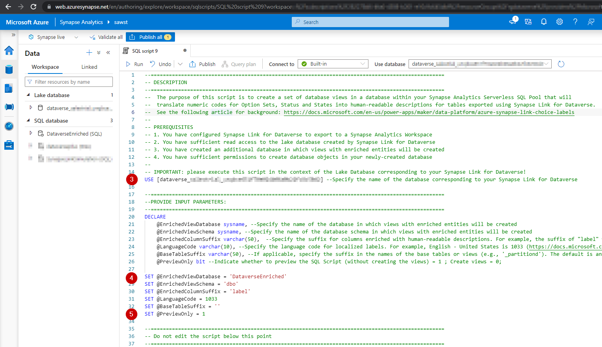

# Synapse-Link-for-Dataverse-data-enrichment-in-Serverless-SQL-Pools

## Background and Problem Statement
[Microsoft Dataverse](https://docs.microsoft.com/en-us/power-apps/maker/data-platform/data-platform-intro) is a secure and versatile data storage and management layer for a variety of business applications, such as Microsoft Dynamics, Power Apps, Power Automate, etc. [Synapse Link for Dataverse](https://docs.microsoft.com/en-us/power-apps/maker/data-platform/export-to-data-lake) provides a seamless integration mechanism between Dataverse and your Synapse Analytics workspace by continuously exporting relevant data for analytics and business intelligence purposes.

Data exported from Microsoft Dataverse into Synapse Analytics Workspaces using Synapse Link for Dataverse includes choice, status and state columns represented as integers. These integer values must be translated into descriptive, localized labels to make the data human-readable. 

When accessing the Synapes Link for Dataverse data through a Synapse Analytics Serverless SQL Pool, this can be accomplished by joining the raw data with the system-generated tables containing the mapping of code values to their descriptions, as documented in the followign article: https://docs.microsoft.com/en-us/power-apps/maker/data-platform/azure-synapse-link-choice-labels. Yet, the potentially large number of joins that must be performed to translate each code into a corresponding label make this process tedious and labor-intensive.

## Solution
This repository includes a utility for enriching the raw integer values found in these columns into human-readable descriptions. This utility facilitates the creation of database views in a database within your Synapse Analytics Serverless SQL Pool that will translate numeric codes for Option Set Metadata, Global Option Set Metadata, Status Metadata and State Metadata into human-readable descriptions for tables exported using Synapse Link for Dataverse.

### Prerequisites
1. You have [configured Synapse Link for Dataverse to export to a Synapse Analytics Workspace](https://docs.microsoft.com/en-us/power-apps/maker/data-platform/azure-synapse-link-synapse)
2. You have sufficient read access to the lake database created by Synapse Link for Dataverse and to the underlying Data Lake storage account.

### Implementation
1. The Lake Database created by Synapse Link for Dataverse is fully managed by the Synapse Link and is only accessible in read-only mode. Hence, we will need to create another database for the views with enriched entities. 
For example, you may execute the folloing T-SQL statement to create the database: 
>`CREATE DATABASE DataverseEnriched`

2. Open the [Enrich Synapse Link for Dataverse Entities with Human-Readable Labels.sql](https://github.com/slavatrofimov/Synapse-Link-for-Dataverse-data-enrichment-in-Serverless-SQL-Pools/blob/main/SQL/Enrich%20Synapse%20Link%20for%20Dataverse%20Entities%20with%20Human-Readable%20Labels.sql) file found in the SQL folder of this repository in your Synapse Analytics Workspace (or in your favorite SQL authroing tool connected to your Serverless SQL Pool). 

3. Specify the name of the database in the context of which the script neeeds to run (this should be the lake database created by Synapse Link for Dataverse).

4. Specify the values for user-configurable variables in your script, as illustrated in the screenshot below. Detailed explanations for each user-configurable variable are included within the SQL script.

5. Set the `@PreviewOnly` variable to 1 and run the script to generate a preview of the SQL statements that will be used to create enriched database views. You may examine these views to validate that the database objects generated by this script match your expectations. 
> Note that no databaes objects are created when you run the script with the `@PreviewOnly = 1` setting.

5. After examining the preview of the SQL statements generated in the previous step, set the  `@PreviewOnly` variable to 0 and re-run the script. When `@PreviewOnly = 0`, new views will be created in your database. Any existing views with matching names will be updated.

## Additional Considerations
The views with enriched data generated by this solution simplify the process of accessing and analyzing your Dataverse data and making the data human readable. Yet, these views may include a large number of joins to the metadata tables containing descriptive values for each relevant column. The large numebr of joins may adversely impact query performance. To improve query performance, consider editing the views by removing the joins and column references that are not necessary for your analytical purposes. 

Furthermore, you may consider copying and persistently storing the enriched data into another data repository intended for high-performance query workloads

## Acknowledgements
Special thanks to [Scott Sewell](https://github.com/mscottsewell) for solution testing and validation.